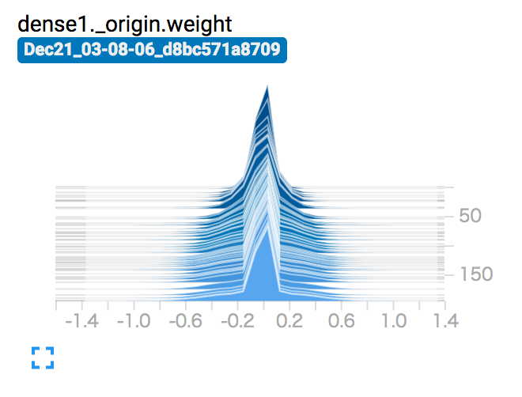
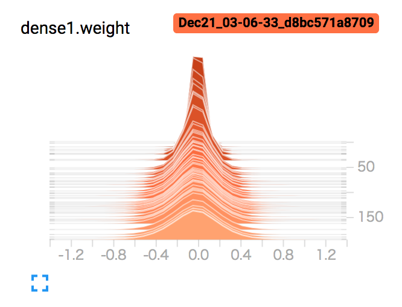

# l0.pytorch

An implementation of **Learning Sparse Neural Networks through $L_0$ Regularization** by C. Louizos, M. Welling and D.P. Kingma.

## Contents

* [LeNet5 with MNIST w/ and w/o L0 norm](mnist.py)
    + `python mnist.py [--baseline]`. `--baseline` is for without L0 norm (original LeNet5).
    + LeNet5 with L0 regularization achieves 0.9% validation error as mentioned in the paper.

* [an interactive explanation about the hard concrete distribution](notebooks/hard_concrete.ipynb)

## Requirements

* PyTorch 0.3/ torchvision 0.2
* tensorboard-pytorch
* tqdm

## Results

### LeNet5

Not yet strictly measure how sparse the L0 regularized model is, but show histograms of the first convolutional layers' weights.

* with L0 normalization

* without L0 normalization

## ToDo

- [ ] Regularization for biases (currently only weights are regularized).
- [ ] More complex architectures with L0 Norm.

